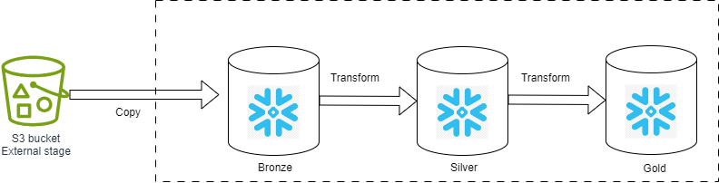

# Data Engineering Project

This is an introduction to how schedule sql transformations in snowflake.

## Overview

If you work as a data analyst/engineer, you probably work with SQL. Although SQL is simple to learn, you may have already wondered how to get your SQL code to run automatically.
In this demo, we present 3 examples to automatically execute your SQL code,  
  * Using snowflake Tasks and Streams
  * Using apache aiflow dag
  * Using Kestra flow

###  Workflow architecture 
  

### Data model
  

## Prerequisites

Before running the project. You need:

- Snowflake trial account
- Docker desktop installed
- Airflow docker image
- Kestra docker image

## How to Run This Project

To start, you need to clone or download the github projet.

### Snowflake data pipeline automating:

Snowflake Taks provide a powerful way to implement continuous ELT pipelines by combining them with Snowflake Table Streams. Snowflake Streams can capture real-time changes to source tables, while Tasks process changed data incrementally.  
Specifically, you can create a Table Streams on a source table to buffer INSERT, UPDATE, and DELETE operations. A Task can then be defined to poll the Stream on a scheduled interval using SYSTEM$STREAM_HAS_DATA(). This function checks if the stream contains new modified data.  
If there is new data, the Task will execute a query to extract the modified rows from the Stream.  
For example, it can insert only new INSERT rows into a separate audit table. If the Stream contains no new data, the Scheduled Task will simply skip the current execution.  

1. Connect to you snowflake accout.  
2. Open snowflake worksheet.  
3. 
First, copy and run the following scripts one by one to first understand how snowflake tasks and streams work.  
  * snowflake/task-examples.sql  
  * snowflake/task-streams.sql  
  * snowflake/task-streams-examples.sql  
4. After this you can run the following scripts implement the data pipline describe above.  
  * snowflake/raw_hosts_task.sql  
  * snowflake/src_hosts_task.sql  
  * snowflake/raw_listings_task.sql  
  * snowflake/src_listings_task.sql  
  * snowflake/dmt_host_listings_task.sql  

## Lessons Learned

Choosing between Kestra and Airflow will depend on your specific needs, your familiarity with the platforms, and the complexity of your pipelines. If you're looking for a simple, easy-to-use platform, Kestra may be a better fit. On the other hand, if you need a more mature platform with a wide range of features and integrations, Airflow might be the better choice.

## Contact

Please feel free to contact me if you have any questions at:   
LinkedIn : https://www.linkedin.com/in/axel-tifrani/  
Email : axeltifrani@gmail.com  
 